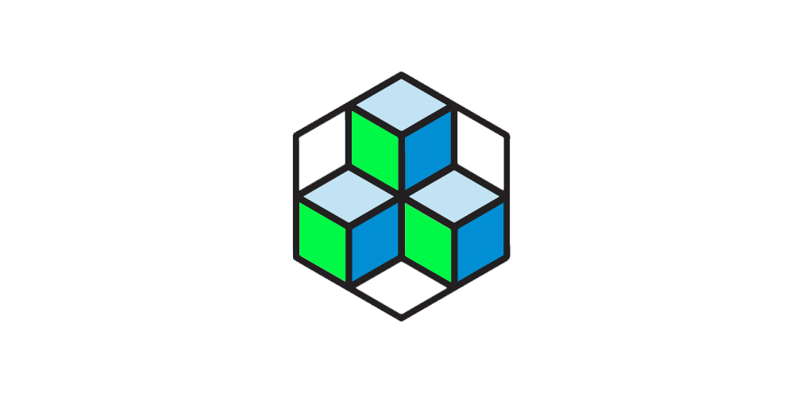

Redis and MongoDB L2 cache. Redis is L1. MongoDB is L2. Do not lose the advantages of CRUD，Implement database cache. This project uses Node.js development. Service can be set up with a simple configuration.


## Version

* ``In development.``
* ``0.0.1 Nightly Build.``


## About

* This service need **Node.JS®**.
* This service provides a remote call API and client SDK.
* Use TCP/UDP to send system information between nodes and centers.


## You need to

``You need to have the following dependencies ready.``

#### System environment

* [MongoDB](https://www.mongodb.com/) **(>= 3.6.x)** MongoDB is a document database with the scalability and flexibility that you want with the querying and indexing that you need.
* [Redis](https://redis.io/) **(>= 4.x)** Redis is an open source (BSD licensed), in-memory data structure store, used as a database, cache and message broker.
* [Node.JS](https://nodejs.org) **(>= 10.x)** Node.js® is a JavaScript runtime built on Chrome's V8 JavaScript engine.

#### NPM module dependencies

* [mongodb](https://github.com/mongodb/node-mongodb-native) Mongo DB Native NodeJS Driver.
* [redis](https://github.com/NodeRedis/node_redis) redis client for node.
* [toml](https://github.com/BinaryMuse/toml-node) TOML parser for Node.js and the Browser. Parses TOML v0.4.0.


## Install

``You need download packeg or git clone.``

#### Git

```console
git clone https://gitee.com/jessehealth/spermWhale
```

#### Download

```console
~ tar zxvf cachel2
~ cd cachel2
~ ./run.sh
```

## PATH

``Set project path``

```bash
export SPERMWHALE_HOME = "Your project home directory"
export SPERMWHALE_CONF = "Your project configure directory"
```


## Configure

``Detailed description of the configuration file``

- net.listen `89` port or unix damoin.


## License

[MIT](./LICENSE)

Copyright (c) 2018 Mr.Panda.